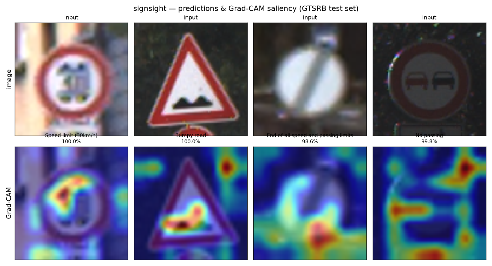
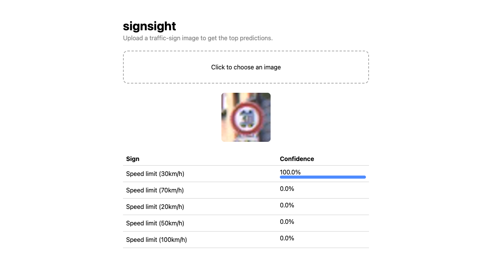
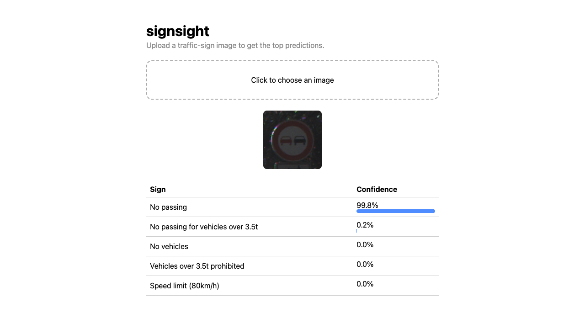

# signsight

Recognise German traffic signs from images. A small but complete computer-vision
project that goes **from raw dataset → trained model → deployed inference API**,
written to be read.

It deliberately covers the three things an AI/CV engineer does day to day:

1. **Computer vision** — convolutional network for 43-class traffic-sign
   recognition on the GTSRB benchmark, plus **Grad-CAM** to see *where* the
   model looks.
2. **Model training** — a clean, config-driven PyTorch training pipeline
   (augmentation, train/val split, scheduler, checkpointing, metrics).
3. **Software engineering / deployment** — the trained model served behind a
   **FastAPI** endpoint, containerised with Docker, tested with pytest, and
   wired to CI.

> Trained, evaluated, and served end to end — see [Results](#results-from-a-real-run).

## Quick start

```bash
pip install -r requirements.txt

# Train (downloads GTSRB automatically on first run)
python -m signsight.train --config configs/default.yaml

# Evaluate on the test split -> prints accuracy, writes a confusion matrix
python -m signsight.evaluate --checkpoint checkpoints/best.pt

# Explain a single prediction with Grad-CAM
python -m signsight.gradcam --checkpoint checkpoints/best.pt --image path/to/sign.png

# Serve it
uvicorn serve.main:app --reload      # then open http://localhost:8000
```

## Project layout

```
signsight/        the CV + training library
  data.py         GTSRB loading, augmentation, dataloaders
  model.py        TrafficSignCNN (from scratch) + transfer-learning option
  train.py        config-driven training loop
  evaluate.py     accuracy, per-class report, confusion matrix
  gradcam.py      Grad-CAM saliency visualisation
  infer.py        load a checkpoint, predict on one image
configs/          experiment configs (yaml)
serve/            FastAPI app + Dockerfile + demo page
tests/            unit tests (run without the dataset, CPU only)
```

## Results (from a real run)

Trained on an Apple M-series GPU (MPS), 12 epochs, a few minutes:

| Metric | Value |
|--------|-------|
| Best validation accuracy | **99.44%** |
| Test accuracy (12,630 images) | **92.74%** |
| Parameters | ~0.6M |

The full training curve, confusion matrix, and Grad-CAM examples are in
[`docs/RESULTS.md`](docs/RESULTS.md); the raw per-epoch log is committed at
[`docs/assets/training-log.txt`](docs/assets/training-log.txt).

### Predictions & Grad-CAM (real test images)



### The served app (live)

The FastAPI service running with the trained checkpoint, classifying uploaded
signs — a clear case (left) and a dark, hard one the model still gets at 99.8%
with a sensible runner-up (right):

| Speed limit (30km/h) — 100% | No passing — 99.8% |
|---|---|
|  |  |

## License

MIT — see [LICENSE](LICENSE).
