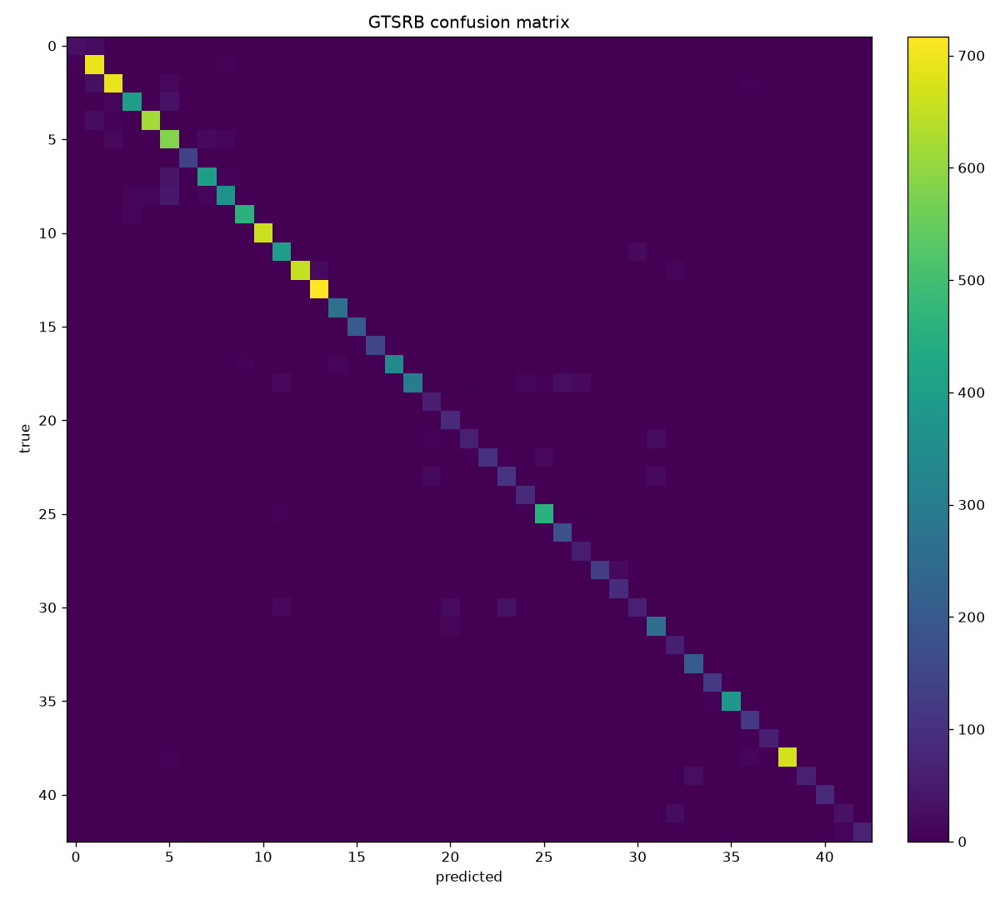

# Results

A real training run of the default `cnn` config on GTSRB (43 classes), on an
Apple M-series GPU (MPS backend). Everything below is reproduced by the
commands at the bottom; the raw per-epoch log is in
[`assets/training-log.txt`](assets/training-log.txt).

## Headline

| Metric | Value |
|--------|-------|
| Best validation accuracy | **99.44%** |
| Test accuracy (12,630 images) | **92.74%** |
| Parameters | 629,291 (~0.6M) |
| Epochs | 12 |
| Device | MPS (Apple Silicon) |
| Wall-clock | a few minutes |

The validation/test gap is expected on GTSRB: the official test set is drawn
from different physical signs and is genuinely harder than a held-out slice of
train. A compact 32×32 model with light augmentation lands around ~93% on
test; the `resnet18` transfer variant and a larger input size close most of
that gap (left as the obvious next experiment).

## Training curve (from the actual run)

```
epoch  1/12  train 1.953/41.7%  val 0.840/73.5%
epoch  2/12  train 0.866/71.6%  val 0.334/89.0%
epoch  3/12  train 0.544/82.1%  val 0.243/91.9%
epoch  4/12  train 0.408/86.7%  val 0.158/94.9%
epoch  5/12  train 0.317/89.5%  val 0.127/95.7%
epoch  6/12  train 0.246/92.1%  val 0.077/97.5%
epoch  7/12  train 0.208/93.3%  val 0.058/98.3%
epoch  8/12  train 0.177/94.3%  val 0.044/99.1%
epoch  9/12  train 0.153/95.3%  val 0.035/99.2%
epoch 10/12  train 0.136/95.7%  val 0.028/99.4%
epoch 11/12  train 0.122/96.4%  val 0.026/99.4%
epoch 12/12  train 0.117/96.4%  val 0.025/99.3%
```

Loss falls and accuracy rises monotonically with no sign of overfitting on the
validation curve — the regularisation (dropout + augmentation + weight decay)
is doing its job.

## Confusion matrix



Near-diagonal: most error mass is between visually similar speed-limit signs
(e.g. 30 vs 80 km/h), which is exactly where a small model struggles.

## Grad-CAM


Top row: input test images. Bottom row: Grad-CAM overlay with the predicted
label and confidence. The heat concentrates on each sign's interior (numerals
/ pictogram) rather than the background — the cue we want it to use.

## The served app

The FastAPI service with the trained checkpoint, classifying uploaded signs:

| Clear case | Hard (dark) case |
|---|---|
|  |  |

Even the dark, low-contrast "No passing" sign is classified at 99.8%, with the
near-identical "No passing for vehicles over 3.5t" as the sensible runner-up.

## Reproduce

```bash
pip install -r requirements.txt

python -m signsight.train    --config configs/default.yaml
python -m signsight.evaluate --checkpoint checkpoints/best.pt
python -m signsight.gradcam  --checkpoint checkpoints/best.pt \
                             --image data/gtsrb/GTSRB/Final_Test/Images/00100.ppm \
                             --out docs/assets/gradcam-sample.png
```
